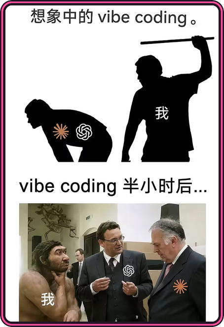

# 当你问我，世界上最完美的东西是什么

我：结婚登记表

这题没有第二种答案

不同意见可以保留，本页暂不接受申诉

 

---

## 你怎么还在往下翻

这里没准备技术履历，也没有改变世界的开源项目

只是一个普通互联网居民，兴趣偶尔漂移

> [!NOTE]
> 本页面不提供技能证明，只存放兴趣、木更和一些偶尔能够运行的代码

  <kbd>VIBE CODING</kbd>&nbsp;
  <kbd>BLOG DESIGN</kbd>&nbsp;
  <kbd>LLM RP</kbd>&nbsp;
  <kbd>MMD</kbd>

既然还没走，那就随便聊点正在折腾的东西

 

---

## 关于代码

我的主要开发方式是 **Vibe Coding**

流程大概是这样：

1. 我产生一个想法
2. AI 表示完全理解
3. AI 开始写代码
4. 我在旁边随缘看着
5. 程序居然运行了
6. 我们都不知道为什么

我负责讲感觉、点运行，出事后让它“再仔细检查一下”

> 熟练度随当天模型状态浮动

 

---

## 关于博客

文章没写多少，主题倒改过很多次

几个小时可以花在字体、间距、颜色上，正文留给下次

比起持续更新，我更在意它看起来是不是自己的地方

---

## 关于 LLM RP

偶尔试着让一团概率分布看起来像个真实的人

不算研究，更像是在角色设定、提示词、记忆和上下文之间反复折腾

效果好的时候很有意思，效果不好时它会用三段话重复刚说过的内容

---

## 关于 MMD

稍微知道怎么让角色动起来

会一点动作、镜头和时间轴，在“差不多能看”和“这里好像不太对”之间来回调整

离专业制作很远，但看到喜欢的角色按自己的想法动起来已经很有意思

---

## 所以，我到底是什么方向的开发者

暂时没打算给自己定方向

看到什么有意思就折腾一下，借助 AI、搜索引擎和偶尔出现的耐心，把它弄到能跑

非要起个名字的话：

> **随缘型数字内容施工人员**

---

## 当 AI 第六次告诉我“问题已经修复”

而页面还是一片空白：

> [!WARNING]
> 木更已进入战斗模式，建议 AI 重新检查它声称已经修复的内容

请它重新组织语言

 

---

## 感谢你看到这里

这个主页不会告诉你我有多专业

它大概只说明，我确实喜欢这些东西

前面的结婚登记表具有法律效力吗？

现在没有

 

本页由本人、木更、若干临时想法和大量搜索记录共同维护

木更（Kisara）｜《Engage Kiss》

